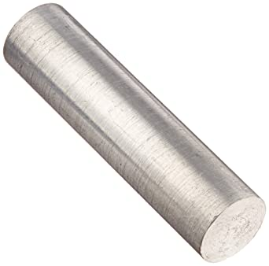

**Laboratórny protokol**
Meranie hustoty objektov
**Adam Jenča**
Príma A
Fyzika

Teoretický Úvod
===============

Hustota \(\varrho_x\) popisuje pomer hmotnosti a objemu kocky vyrobenej z materiálu \(x\).
Vzorec pre hustotu pri hmotnosti \(m\) a objeme \(V\) je \(\varrho = \frac{m}{V}\).

Jednotky hustoty
----------------

Jednotky hustoty sa píšu vo formáte \(\frac{J_m}{J_V}\) kde \(J_m\) je jednotka hmotnosti a \(J_V\) je jednotka objemu.
Základná jednotka hustoty je \(\frac{g}{cm^3}\) (\(\varrho_x = n\frac{g}{cm^3}\) znamená, že kocka z materiálu \(x\) s objemom \(1cm^3\) váži \(n\) gramov) .

Popis experimentu
=================

 [fig:valec]

Potrebujeme zistiť hustotu neznámeho materiálu. Máme k dispozícii 4 valčeky z tohto materiálu (pozri **Obrázok [fig:valec]**), každý inej veľkosti.

Pomôcky
-------

Na experiment potrebujeme:

-   odmerný valec

-   váhy

-   valčeky

-   vodu

