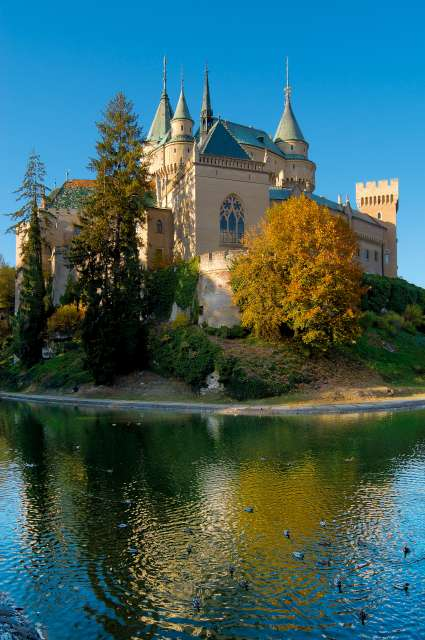
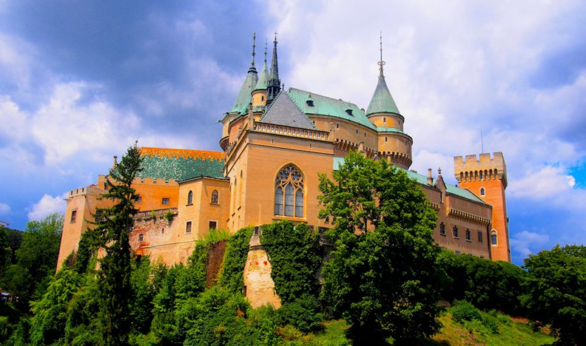

KULTÚRNE A HISTORICKÉ PAMIATKY TRENČIANSKEHO SAMOSPRÁVNEHO KRAJA
----------------------------------------------------------------

*Bude treba dať do bodov.*

Bojnický zámok
==============

Prvá písomná zmienka:1113
Patril Matúšovi Čákovi Trenčianskemu, Thurzovcom a Pállfyovcom.
Pôvodne drevený hrad, prestavaný do kameňa cez gotický štýl v 13.storočí, na renesančný zámok sa zmenil v 16.storočí, v barokovom slohu bol prerobený v 17.storočí a na neogotický zámok ho zmenili na prelome 19. a 20. storočia.
V roku 1970 bol vyhlásený za Národnú kultúrnu pamiatku.
V súčasnosti v ňom sídli časť Slovenského Národného Múzea.

Obrázky
^^^^^^^

napr. 

alebo

Trenčiansky hrad
================

Pôvodne strážny hrad z 11. storočia. V minulosti bol centrom správy okolia Trenčína.
Najväčší rozmach zažil  za vlády Matúša Čáka Trenčianskeho.
Potom ho vlastnili Thurzovci a Ilesháziovci.
Hrad zažil požiar v roku 1790 a spustol.

V polovici 20. storočia sa začali výskumné a rekonštrukčné práce na hrade.
Dnes je hrad sprístupnený návštevníkom a stal sa jednou z dominánt Považia.

Obrázky
^^^^^^^

https://lh3.googleusercontent.com/p/AF1QipMmt62mPCf9zXR1UwT3hzlL1WR0FP2YDlelH1vq=s680-w680-h510

Hrad Beckov
===========

Prvá písomná zmienka 1264.
Začiatkom 14. storočia patril Matúšovi Čákovi Trenčianskemu. Potom ho prevzal poľský šľachtic Stibor zo Stiboríc. Za jeho vlády prešiel  hrad najvýraznejšou premenou.
Po vymretí Stiborovcov sa novými majiteľmi stali Bánfiovci. Tí hrad prestavali do dnešnej podoby. Neskoršie sa hrad zmenil na väznicu a schátral. V roku 1729 vyhorel.

Obrázky
^^^^^^^

https://www.tsk.sk/buxus/images/content/7divovTSK/Beckov_hrad.jpg

